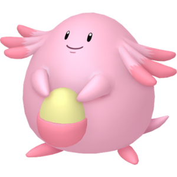
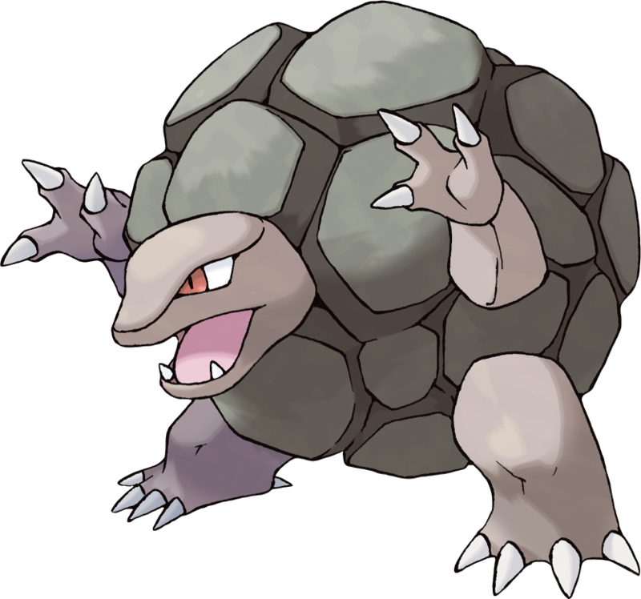
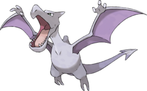
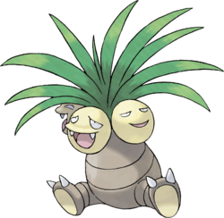

```{r setup, include=FALSE}
knitr::opts_chunk$set(echo = TRUE)
library('plyr')
library('ggplot2')

```

### Description

Cette etude est réalisée sur des pokémons de première génération. Lors de cette étude nous avons analysés les données tirés d'un jeu de données trouvé sur Kaggle. Ce jeu fut complété via le site poképedia afin d'avoir un ensemble de données exploitable.

La base de données comporte un ensemble de 6 tables:

- une table contenant l'ensemble des pokémons
- une table contenant le type de chaque pokemon 
- une table donnant des informations sur l'évolution des pokémon
- une table avec les dresseurs "majeurs" de cette génération
- une table contenant les pokemon possédé par le joueur qui ne figurent pas dans son équipe
- une table des équipes du joueur et des dresseurs "majeurs"

Dans l'univers Pokémon les combats sont l'activité principal. Dans cet univers chaque créature possède un type ainsi qu'un nombre de de statistique bien définit cette étude vise à mettr en avant les pokémons les plus performents selon différents critères

```{r,include=FALSE}
pokemon <- read.csv2("pokemon.csv", h = T)
type <- read.csv2("estType.csv", h = T)
evolution <- read.csv2("evolueEn.csv", h = T)
dresseur <- read.csv2("dresseur.csv", h = T)
detientPokemon <- read.csv2("detientPokemon.csv", h = T)
stockPokemon <- read.csv2("stockePokemon.csv", h = T)

```

nombre de pokémon :

```{r,echo=FALSE}

length(pokemon$id_pok)

```

type répertorié :

```{r,echo=FALSE}
unique(type$type_pok)
```

\newpage

nombre de pokémon par type :

```{r,echo=F}
library("ggplot2")
ggplot(type) +
  aes(x = type_pok) +
  geom_bar(fill = "#0C4C8A") +
  labs(
    x = "type",
    y = "nb de Pokemon",
    title = "nombre de pokémon par type"
  ) +
  theme_linedraw() +
  theme(
    plot.title = element_text(size = 16L,
                              face = "bold",
                              hjust = 0.5),
    axis.title.y = element_text(face = "bold")
  )+theme(axis.text.x = element_text(size = 14,angle = 45))
```

## Etude des pokémon en fonction de leur PV

Dans Pokémon chaque créature possède un nombre de Point de Vie (PV) bien définit une fois à 0 le pokémon est considéré comme KO est n'est plus utlisable. on peut donc considéré que plus un pokémon a de point de vie, plus il pourra rester au combat et, par conséquent, gagner ce dernier.


Classement des 5 meilleurs et des 5 pokémons les moins bons. On peut y voir le nom du pokémon ainsi que se statistique en PV.
```{r, echo=FALSE}
A = ddply(pokemon, .(-PV), transform)
fus1 <- c(A[1,3],A[2,3],A[3,3],A[4,3],A[5,3])
fus2 <- c(A[1,4],A[2,4],A[3,4],A[4,4],A[5,4])
fusion <-cbind(fus1,fus2)
df <-data.frame(fus1,fus2)
ggplot(df, aes(reorder(fus1, -fus2),fus2))+ geom_bar(stat="identity", color='black',fill='green')+labs(title = "top 5 des meilleurs pokémon en PV",x = "nom du pokémon", y = "PV")+theme_classic()+theme(axis.text.x = element_text(size = 10,angle = 45))

B = ddply(pokemon, .(PV), transform)
fus1 <- c(B[1,2],B[2,2],B[3,2],B[4,2],B[5,2])
fus2 <- c(B[5,3],B[4,3],B[3,3],B[2,3],B[1,3])
fusion <-cbind(fus1,fus2)
df <-data.frame(fus1,fus2)
ggplot(df, aes(reorder(fus1, +fus2),fus2))+ geom_bar(stat="identity", color='black',fill='red')+labs(title = "top 5 des meilleurs pokémon en PV",x = "nom du pokémon", y = "PV")+theme_classic()+theme(axis.text.x = element_text(size = 10,angle = 45))

```


## Etude des pokémons en fonxtion de leur attaque 

La caractéristique d'attaque lors d'un combat la statistique d'attaque permet d'infliger des dégats, faire perdre des points de vie au pokémon adverse les valeurs des dégats infligés varie selon deux facteurs: l'attaque du lanceur et la defense du receveur.
Ici l'attaque est considéré comme physique.


```{r, echo=FALSE}
A = ddply(pokemon, .(-Force), transform)
fus1 <- c(A[1,3],A[2,3],A[3,3],A[4,3],A[5,3])
fus2 <- c(A[1,5],A[2,5],A[3,5],A[4,5],A[5,5])
fusion <-cbind(fus1,fus2)
df <-data.frame(fus1,fus2)
ggplot(df, aes(reorder(fus1, -fus2),fus2))+ geom_bar(stat="identity", color='black',fill='green')+theme_classic()+labs(title = "top 5 des meilleurs pokémon en attaque",x = "nom du pokémon", y = "attaque")+theme(axis.text.x = element_text(size = 10,angle = 45))

B = ddply(pokemon, .(Force), transform)
fus1 <- c(B[1,2],B[2,2],B[3,2],B[4,2],B[5,2])
fus2 <- c(B[5,4],B[4,4],B[3,4],B[2,4],B[1,4])
fusion <-cbind(fus1,fus2)
df <-data.frame(fus1,fus2)
ggplot(df, aes(reorder(fus1, +fus2),fus2),xlab == "nom des pokémons")+ geom_bar(stat="identity", color='black',fill='red')+theme_classic()+labs(title = "top 5 des moins bon pokémon en attaque",x = "nom du pokémon", y = "attaque")+theme(axis.text.x = element_text(size = 10,angle = 45))

```

## Etude des pokémons en fonction de la défense 

la défense est le dernier facteur a rentrer en compte dans le triptique attaque/PV/defense c'est la valeur qui réduit le nombre de point de vie perdu lors d'une attaque. sous un autre angle, plus la défense est élevé, moins le receveur ne subira de dégat.

```{r, echo=FALSE}
A = ddply(pokemon, .(-Defense), transform)
fus1 <- c(A[1,3],A[2,3],A[3,3],A[4,3],A[5,3])
fus2 <- c(A[1,5],A[2,5],A[3,5],A[4,5],A[5,5])
fusion <-cbind(fus1,fus2)
df <-data.frame(fus1,fus2)
ggplot(df, aes(reorder(fus1, -fus2),fus2))+ geom_bar(stat="identity", color='black',fill='green')+theme_classic()+labs(title = "top 5 des meilleurs pokémon en défense",x = "nom du pokémon", y = "défense")+theme(axis.text.x = element_text(size = 10,angle = 45))

B = ddply(pokemon, .(Defense), transform)
fus1 <- c(B[1,2],B[2,2],B[3,2],B[4,2],B[5,2])
fus2 <- c(B[5,4],B[4,4],B[3,4],B[2,4],B[1,4])
fusion <-cbind(fus1,fus2)
df <-data.frame(fus1,fus2)
ggplot(df, aes(reorder(fus1, +fus2),fus2),xlab == "nom des pokémons")+ geom_bar(stat="identity", color='black',fill='red')+theme_classic()+labs(title = "top 5 des moins bon pokémon en défense",x = "nom du pokémon", y = "défense")+theme(axis.text.x = element_text(size = 10,angle = 45))

```

## Etude des pokémons en fonction de la vitesse 

la vitesse est un facteur décisif dans la stratégie pokémon elle permet au pokémon le plus rapide d'attaquer en premier. les pokémon les plus rapide ont de grand chance de gagne run combat

```{r, echo=FALSE}
A = ddply(pokemon, .(-Vitesse), transform)
fus1 <- c(A[1,3],A[2,3],A[3,3],A[4,3],A[5,3])
fus2 <- c(A[1,5],A[2,5],A[3,5],A[4,5],A[5,5])
fusion <-cbind(fus1,fus2)
df <-data.frame(fus1,fus2)
ggplot(df, aes(reorder(fus1, -fus2),fus2))+ geom_bar(stat="identity", color='black',fill='green')+theme_classic()+labs(title = "top 5 des meilleurs pokémon en vitesse",x = "nom du pokémon", y = "vitesse")+theme(axis.text.x = element_text(size = 10,angle = 45))

B = ddply(pokemon, .(Vitesse), transform)
fus1 <- c(B[1,2],B[2,2],B[3,2],B[4,2],B[5,2])
fus2 <- c(B[5,4],B[4,4],B[3,4],B[2,4],B[1,4])
fusion <-cbind(fus1,fus2)
df <-data.frame(fus1,fus2)
ggplot(df, aes(reorder(fus1, +fus2),fus2),xlab == "nom des pokémons")+ geom_bar(stat="identity", color='black',fill='red')+theme_classic()+labs(title = "top 5 des moins bon pokémon en vitesse",x = "nom du pokémon", y = "vitesse")+theme(axis.text.x = element_text(size = 10,angle = 45))

```

## Etude des pokémons en fonction du spécial

Le spécial est la dernier statistique d'un pokémon. Elle fait à la fois office d'attaque et de défense elle est à part entière et n'interfère pas avec les statistiques d'attaque et de défense classique.

```{r, echo=FALSE}
A = ddply(pokemon, .(-Special), transform)
fus1 <- c(A[1,3],A[2,3],A[3,3],A[4,3],A[5,3])
fus2 <- c(A[1,5],A[2,5],A[3,5],A[4,5],A[5,5])
fusion <-cbind(fus1,fus2)
df <-data.frame(fus1,fus2)
ggplot(df, aes(reorder(fus1, -fus2),fus2))+ geom_bar(stat="identity", color='black',fill='green')+theme_classic()+labs(title = "top 5 des meilleurs pokémon en special",x = "nom du pokémon", y = "special")+theme(axis.text.x = element_text(size = 10,angle = 45))

B = ddply(pokemon, .(Special), transform)
fus1 <- c(B[1,2],B[2,2],B[3,2],B[4,2],B[5,2])
fus2 <- c(B[5,4],B[4,4],B[3,4],B[2,4],B[1,4])
fusion <-cbind(fus1,fus2)
df <-data.frame(fus1,fus2)
ggplot(df, aes(reorder(fus1, +fus2),fus2),xlab == "nom des pokémons")+ geom_bar(stat="identity", color='black',fill='red')+theme_classic()+labs(title = "top 5 des moins bon pokémon en special",x = "nom du pokémon", y = "special")+theme(axis.text.x = element_text(size = 10,angle = 45))

```


##Conclusion

D'après cette etude statistique la meilleur équipe possible compte tenu des statistique serais composé de:






